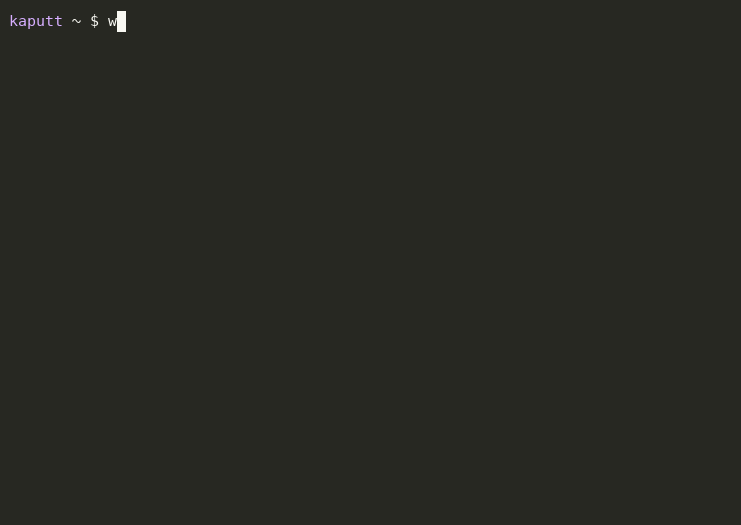

# kaputt — a break/fix wargame

[](https://github.com/leonbubova/kaputt/actions/workflows/ci.yml) [](https://leonbubova.github.io/kaputt/) 




**Something is broken. You fix it.** No slides, no multiple-choice. Each level spins up a real
environment, quietly sabotages one thing, and hands you the incident the way a teammate would report
it. You debug it with the actual tools — `kubectl`, `docker`, `psql`, `git`, `helm` — in your own
terminal. A checker verifies the system genuinely works again, not how you got there.

It runs on disposable environments on your own machine (Mac or Linux). Every level resets clean, so
you can redo it until it is muscle memory.

```
./install.sh            # installs docker / k3d / kubectl / helm, adds wg to PATH
wg track k8s            # pick a discipline (default: k8s)
wg start                # bring the environment up
wg level 1              # load level 1 — something is broken now
kubectl get pods        # your job: find and fix it
wg check                # green = solved → wg next
wg hint                 # stuck? 3 hints per level, counted
wg progress             # scoreboard across every track
wg stop                 # tear the environment down
```

## 60-second quickstart

```
git clone https://github.com/leonbubova/kaputt && cd kaputt
./install.sh && exec $SHELL     # docker/k3d/kubectl/helm + PATH
wg track shell                  # never used a terminal? start here (no Docker needed)
wg level 1                      # read the ticket, fix it, then:
wg check
```
New to a tool? `wg help` shows the ~10 commands a track uses before you start. Stuck? `wg hint` (3 per level), then `wg spoil`.

## Tracks

Every track goes **beginner → pro**: a "build it" block first (write the manifest, add the route,
create the table), then incidents from easy to hard, with the last levels chaining two faults.

| Track | Levels | You learn |
|---|---|---|
| `shell` | 14 | **start here if you have never used a terminal** — prompt, paths, files, pipes, permissions |
| `k8s` | 33 | pods, deployments, services, probes, RBAC, network policy, ingress, rollouts, nodes, PVCs |
| `linux` | 29 | the shell, permissions, processes, disk, cron, a box that won't behave |
| `git` | 28 | branching, merge conflicts, reflog rescue, rebase, bisect, history surgery |
| `docker` | 27 | images, containers, volumes, networks, compose, healthchecks |
| `nestjs` | 27 | NestJS dependency injection, modules, pipes, guards, HTTP |
| `nextjs` | 28 | Next.js 15 App Router, server/client components, actions, caching |
| `helm` | 20 | charts, values, templates, upgrades, rollbacks |
| `trigger` | 24 | Trigger.dev tasks, retries, schedules, idempotency |
| `supabase` | 24 | Postgres, row-level security, auth, storage, migrations |
| `postgres` | 20 | schema, constraints, indexes, locks, query plans |
| `pentest` | 16 | find **and fix** web-app vulnerabilities (defensive) |
| `nginx` | 17 | reverse proxy, upstreams, TLS, redirects, body limits |
| `networking` | 17 | DNS, ports, routes, bind addresses, firewalls |
| `redis` | 18 | keys, hashes, lists, TTLs, eviction, queues |
| `bash` | 18 | quoting, comparisons, subshells, pipefail, the classic traps |
| `terraform` | 16 | resources, variables, outputs, count/for_each, drift |
| `systemd` | 12 | units, services, timers, ordering, restart policy |
| `tls` | 15 | certificates, chains, SANs, openssl |

Run `wg list` for the tracks on your machine and your status in each.

## How it works

Three layers, each independent of the one below:

1. **`bin/wg`** — the CLI, plain bash. Knows only *tracks* and *levels*. State is plain files under
   `~/.k8s-wargame/` (current level, start time, hint count, scoreboard). No database, no daemon —
   `rm -rf ~/.k8s-wargame` gives you a fresh player.
2. **A track** — a directory `levels/<track>/` whose `track.sh` provides four functions:
   `track_start`, `track_stop`, `track_ready`, `track_wipe` (reset the play area before each level).
   That is the entire plugin interface. `k8s` uses a k3d cluster; `linux` a container; `postgres` a
   Postgres container; `supabase` the real local stack.
3. **A level** — `break.sh` (the sabotage), `check.sh` (exit 0 = solved, checks the *outcome*), a
   `README.md` incident ticket, `hints.md` (three escalating hints), `solution.md`.

## Rules of the game

- `wg check` is the only judge. It verifies the outcome from the outside — does the service answer,
  is the pod stable, can the role list pods — never how you fixed it.
- Hints are counted and `wg spoil` marks a level; both show in `wg progress`.
- A level you cleared is repeatable with `wg reset`. Solve it clean twice on different days before
  you call it learned.

## Requirements

- **Docker** (Docker Desktop, colima, or native). The container/cluster tracks need it.
- **Mac or Linux.** `install.sh` sets up the rest (k3d, kubectl, helm).
- The `systemd` track needs a remote Ubuntu host with systemd and passwordless sudo; point it there
  with `WG_SYSTEMD_HOST=<ssh-host>`. The `supabase` track needs the Supabase CLI and ~2 GB free.
- Heads-up on resources: the k3d cluster is ~1.5 GB. On an 8 GB machine, run one environment at a time.

## Adding a track or a level

See [`docs/track-spec.md`](docs/track-spec.md) for the contract and [`docs/ARCHITECTURE.md`](docs/ARCHITECTURE.md)
for the design. In short: a level is `levels/<track>/NN-slug/` with `README.md`, `break.sh`,
`check.sh`, `hints.md`, `solution.md`. The gate is `test/run-all.sh <track>`: it plays every level —
break, confirm the check fails, apply the reference fix, confirm it passes — and must end `ALL GREEN`.

## Status

Single-player, one environment per machine. Making it multiplayer (per-player isolated environments
so a team can share one host) is tracked as an open issue.
